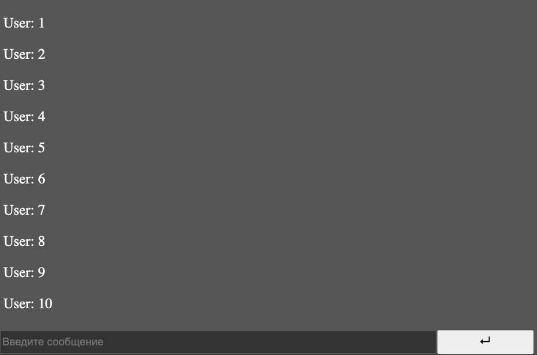

# videojs-chat

Adds a chat to the video player. Activated when the player starts playing. Saves messages to localstorage.



## Installation

```sh
npm install --save videojs-chat
```

## Usage

To include videojs-chat on your website or web application, use any of the following methods.

### `<script>` Tag

This is the simplest case. Get the script in whatever way you prefer and include the plugin _after_ you include [video.js][videojs], so that the `videojs` global is available.

```html
<script src="//path/to/video.min.js"></script>
<script src="//path/to/videojs-chat.min.js"></script>
<script>
  var player = videojs('my-video');

  player.chat();
</script>
```

### Browserify/CommonJS

When using with Browserify, install videojs-chat via npm and `require` the plugin as you would any other module.

```js
var videojs = require('video.js');

// The actual plugin function is exported by this module, but it is also
// attached to the `Player.prototype`; so, there is no need to assign it
// to a variable.
require('videojs-chat');

var player = videojs('my-video');

player.chat();
```

### RequireJS/AMD

When using with RequireJS (or another AMD library), get the script in whatever way you prefer and `require` the plugin as you normally would:

```js
require(['video.js', 'videojs-chat'], function(videojs) {
  var player = videojs('my-video');

  player.chat();
});
```

## License

UNLICENSED. Copyright (c) Artur &lt;@arturvetrov&gt;


[videojs]: http://videojs.com/
